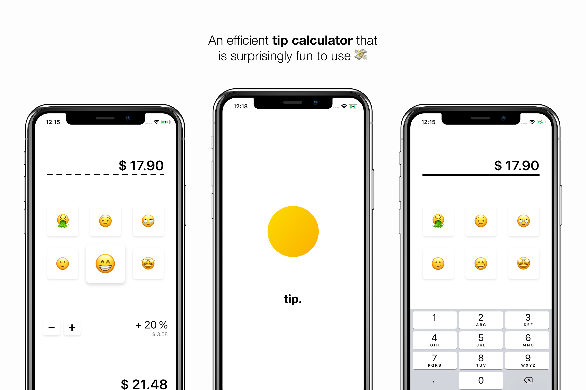

### Tip

### Tip is small but efficient tip calculator for iOS.

Math can be hard and especially on the dinner table I want to spend my time differently. 
Since you made it all the way here, you probably think the same way — I give you a free and playful app to calculate your tips. 

Really, who decided that tip calculator apps should look like they where written for Windows XP? 
Anyone with an explanation? 
So I tried doing something different here.
Just click the emoji that best describes your experience and get a quick suggestion for a tip.
Have fun! 😃

Anyways, here are a few things that make Tip easy to use:

- Automatically opened keyboard for quick entry
- Preconfigured shortcuts to easy the tipping proccess
- Fine-grained adjustment of the suggested tipping percentage
- Copy the final cost to the clipboard by long-pressing on it
- ... and did I mention all those emojis?

#### Get Tip on the App Store

**-->** [Click Here to Download](https://frhlch.at/f/tip?app=1)
